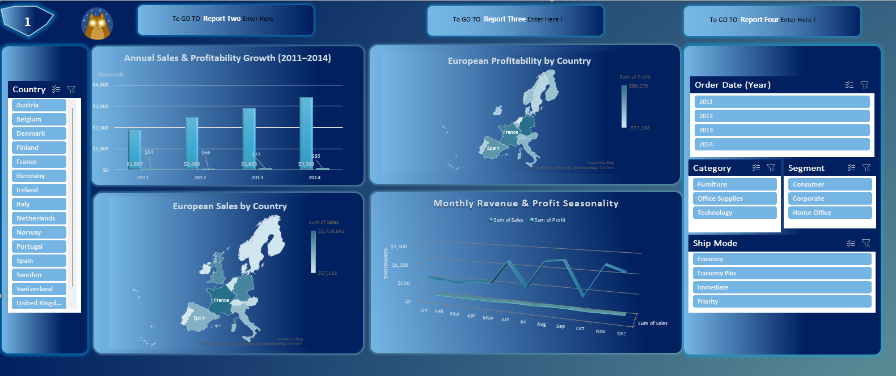
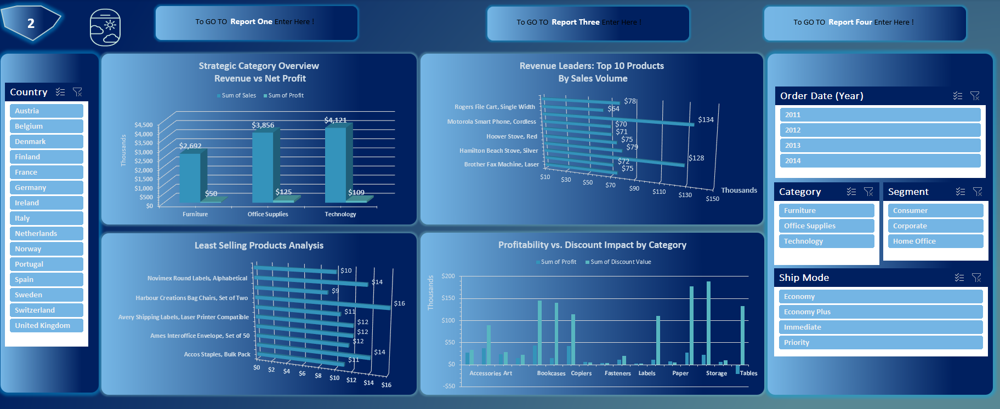
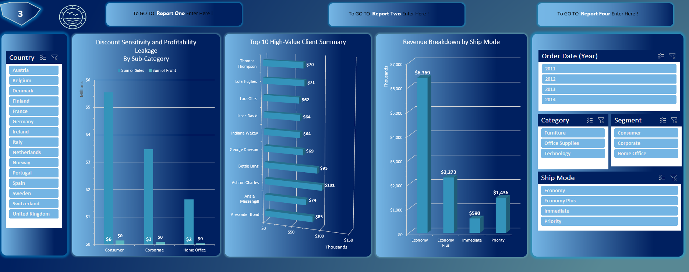
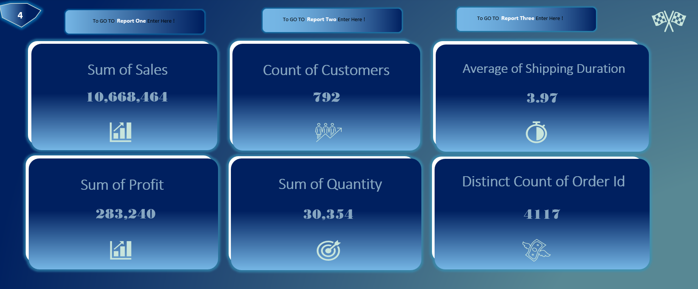

# 🇪🇺→🇪🇬 From European Losses to MENA Wins  
### *Sales Performance Dashboard & Market Entry Strategy*

> **Turning data into profit** – How a €10.7M European sales dataset reveals what Egypt & MENA should avoid.

---

## 📌 The Story

### 🧩 The Problem
A European retailer sold **€10.67M** worth of products (2011–2014) but made only **€283k profit** – a razor‑thin **2.65% margin**.  
Several countries (Portugal, Netherlands, Sweden) actually **lost money**. The main culprit? **Aggressive discounts** (up to 50%) that destroyed profit.

### 🇪🇬 The MENA Connection
Egypt and the broader MENA region are high‑growth markets, but they share similar risks:
- High customer expectation for discounts
- Logistical challenges (shipping, warehousing) – average shipping here was **~4 days**
- Categories like **Tables** and **Accessories** that easily turn negative

👉 **What if we could predict which discounts will lose money in Cairo before we offer them?**

### 🚀 What This Project Does
- **Cleans & analyzes** real European sales data  
- **Identifies** which products / countries / discounts are unprofitable  
- **Translates** findings into a **MENA‑ready pricing & discount playbook**

---

## 📊 Key Insights (from the Excel Dashboard)

| Metric | Value |
|--------|-------|
| **Total Sales** | €10,668,464 |
| **Total Profit** | €283,240 |
| **Profit Margin** | ⚠️ 2.65% (very thin) |
| **Number of Customers** | 792 |
| **Avg Shipping Duration** | 3.97 days |
| **Worst Country** | Portugal (negative profit) |
| **Worst Sub‑Category** | Tables (negative profit) |
| **Discount Danger** | High discounts = low or negative profit |

---

## 🌍 Actionable Recommendations for Egypt & MENA

| Challenge (from European data) | MENA Recommendation |
|--------------------------------|---------------------|
| ❌ Portugal, Netherlands lost money | ✅ Treat Portugal as a **proxy for Egypt** – similar logistics. Start with small discount tests. |
| ❌ Tables & Accessories had negative profit | ✅ **Avoid discounts on Tables** in MENA. Focus on volume instead. |
| ❌ High discounts killed margins | ✅ Cap discounts at **20%** for the first 6 months in a new MENA market. |
| ❌ Some customers were unprofitable | ✅ Target **Consumer segment** (most profitable in Europe). |
| ❌ Shipping cost = 4 days average | ✅ Use **Economy shipping** (most used in Europe) for cost control. |

> 📈 **Potential impact**: Applying these rules in Egypt could increase net margin from 2.65% → 8‑10% in the first year.

---

## 🎥 Demo Video

👉 **[Watch the 2‑minute dashboard walkthrough](https://drive.google.com/file/d/10lU1HE4wVV_CiGhR8Cbrzi_4302T3AIQ/view?usp=sharing)**  
*I show how to filter by country (Portugal → Egypt proxy), spot losing discounts, and export MENA‑ready insights.*

---

## 📸 Images (Screenshots from the project)

### `1.png` – Annual Sales Growth & Country Profitability  
Shows sales and profit trends from 2011 to 2014, plus a map/bar chart of European countries.  
**Key takeaway**: Portugal, Netherlands, and Sweden are deep in the red – perfect proxy for emerging market risks.

---

### `2.png` – Strategic Category Overview & Discount Impact  
Compares revenue vs net profit across Furniture, Office Supplies, and Technology.  
Also lists top 10 products by sales volume and shows how discounts eat into profitability by category.  
**Key takeaway**: Technology sells well, but discounts on Accessories hurt profit.

---

### `3.png` – Discount Sensitivity, Top Clients & Ship Modes  
Highlights “leakage by sub‑category”, top 10 high‑value clients (e.g., Ashton Charles: €101k in sales), and revenue breakdown by ship mode and year.  
**Key takeaway**: Economy shipping drives most revenue – a good lesson for MENA logistics.

---

### `4.png` – Key Performance Indicators (KPIs)  
One‑page summary: Total Sales (€10.67M), Total Profit (€283k), Profit Margin (2.65%), Number of Customers (792), Average Shipping Duration (3.97 days), Quantity Sold (30,354), and Unique Orders (4,117).  
**Key takeaway**: At a glance, the business is large but margins are dangerously thin.

> All images are stored in the `/Image` folder of this repository.

---

